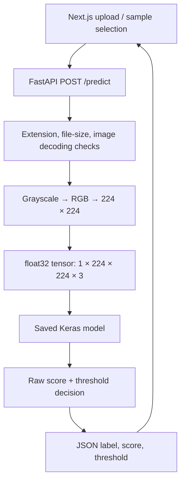

# LungAI

**An educational CT-image classification application with a TensorFlow inference API and a Next.js/TypeScript interface.**

[Frontend demo](https://lung-ai-beta.vercel.app/) · [Inference service](server/app.py) · [API contract](#api-contract) · [Local setup](#local-development)

LungAI implements an end-to-end image inference workflow: upload a CT slice, preprocess it into a model input tensor, execute a saved Keras classifier, and present the predicted label and model score. The frontend and backend are independently deployable services connected by a multipart HTTP API.

> [!WARNING]
> LungAI is an educational demo, not a medical device. It has not been clinically validated and must not be used for diagnosis, treatment, or clinical triage. Do not upload private patient information to a public demo.

## Architecture



## Engineering highlights

- **Model-serving lifecycle:** the backend loads the saved `.h5` model once at process startup and reuses it for requests. `GET /health` reports service and model-load status.
- **Explicit preprocessing contract:** Pillow decodes supported images, converts them to grayscale and then three RGB channels, and resizes them to `224 × 224`. NumPy creates a batch of one with dtype `float32`.
- **Transparent decision rule:** the API returns the raw score and threshold alongside the label, making the classification rule inspectable by clients.
- **HTTP validation:** unsupported extensions and unreadable images return HTTP 400, uploads exceeding 10 MB return 413, and a missing multipart file returns 422.
- **Separation of concerns:** FastAPI owns validation and inference; the TypeScript frontend owns upload/sample selection, request states, and result presentation.
- **Deployment portability:** the Python service has pinned dependencies and a Dockerfile. The frontend uses a build-time API URL and can be deployed separately.

## Inference contract

The model artifact is [server/models/cancer_detection_model.h5](server/models/cancer_detection_model.h5). The service expects to start from `server/`, or from the working directory configured in its Docker image.

For each request:

1. Check the filename extension against JPG, JPEG, and PNG.
2. Read the upload and reject it if its byte length exceeds 10 MB.
3. Decode with Pillow; convert to grayscale, repeat into RGB, and resize.
4. Build a tensor of shape `(1, 224, 224, 3)` with pixel values retained in `[0, 255]`.
5. Evaluate `model.predict(...)` and extract its scalar output.
6. Apply the configured decision boundary.

```text
raw_score > 0.35   → cancer
raw_score <= 0.35  → no_cancer
```

The response field named `confidence` equals `raw_score` for a positive label and `1 - raw_score` otherwise. It is a derived model score, not a calibrated probability of disease. Because the threshold is 0.35 rather than 0.5, a positive label can have a reported confidence below 50%.

The source identifies an EfficientNetB0-style preprocessing convention, but this repository does not include reproducible training or evaluation scripts, a dataset description, or held-out performance metrics. The threshold is an implementation parameter; a claim of improved recall would require comparative evaluation. This project demonstrates model integration and serving.

## API contract

### `GET /health`

```json
{ "status": "ok", "model_loaded": true }
```

### `POST /predict`

Send a multipart form with a `file` field:

```bash
curl -X POST http://127.0.0.1:8000/predict \
  -F "file=@path/to/scan.png"
```

Illustrative response shape; these numbers are not evaluation results:

```json
{
  "label": "cancer",
  "message": "Cancer detected. Please consult a medical professional.",
  "confidence": 0.9187,
  "raw_score": 0.9187,
  "threshold": 0.35
}
```

The label and message are experimental model outputs and must be interpreted under the educational-use limitation above.

| Status | Meaning |
| --- | --- |
| 200 | Inference completed |
| 400 | Unsupported extension or image decoding failure |
| 413 | Uploaded bytes exceed 10 MB |
| 422 | Required file field is missing |

## Stack and source layout

| Layer | Technology |
| --- | --- |
| Frontend | Next.js 14, React 18, TypeScript, Tailwind CSS, Framer Motion |
| API | FastAPI, Uvicorn, multipart uploads |
| Inference | TensorFlow CPU / Keras, NumPy, Pillow |
| Deployment | Backend Dockerfile and Railway configuration; Vercel-compatible frontend |

```text
LungAI/
├── client/
│   ├── public/samples/         # Example image inputs
│   └── src/
│       ├── app/test/page.tsx  # Upload and inference workflow
│       └── components/       # Shared interface components
├── server/
│   ├── app.py                # Validation, preprocessing, prediction
│   ├── models/               # Saved Keras model
│   ├── requirements.txt      # Pinned Python dependencies
│   └── Dockerfile
└── railway.json
```

## Local development

Prerequisites: Git, Node.js/npm compatible with [client/package.json](client/package.json), and Python 3.12 as used by the backend Dockerfile. TensorFlow wheel availability depends on platform; use the containerized backend when a native installation is unavailable.

```bash
git clone https://github.com/syedarman1/LungAI.git
cd LungAI
```

Backend:

```bash
cd server
python3 -m venv .venv
source .venv/bin/activate
pip install -r requirements.txt
LUNGAI_ALLOWED_ORIGINS=http://localhost:3000 \
  uvicorn app:app --reload --host 127.0.0.1 --port 8000
```

Frontend, in a second terminal from the repository root:

```bash
cd client
npm ci
NEXT_PUBLIC_API_URL=http://127.0.0.1:8000 npm run dev
```

Open `http://localhost:3000/test`. The [frontend example configuration](client/.env.local.example) documents the API URL.

| Variable | Used by | Purpose |
| --- | --- | --- |
| `NEXT_PUBLIC_API_URL` | Frontend | Backend URL embedded at build time |
| `LUNGAI_ALLOWED_ORIGINS` | Backend | Comma-separated allowed browser origins; defaults to `*` |
| `PORT` | Container startup | Listening port; defaults to 8000 |

## Deployment and verification

Build the backend from the repository root, since the Dockerfile copies paths under `server/`:

```bash
docker build -f server/Dockerfile -t lungai-api .
docker run --rm -p 8000:8000 \
  -e LUNGAI_ALLOWED_ORIGINS=http://localhost:3000 lungai-api
```

Deploy `client/` as the frontend project root and set `NEXT_PUBLIC_API_URL` to the backend's HTTPS URL. [railway.json](railway.json) configures the backend Dockerfile, port handling, and health check.

Available checks, from the repository root:

```bash
python3 -m py_compile server/app.py
npm --prefix client run lint
npm --prefix client run build
curl http://127.0.0.1:8000/health
```

These checks cover syntax, frontend lint/build, and service reachability. There is no application-specific automated backend test suite or reproducible model benchmark in the current repository.

## Design limits and next steps

Uploads are read completely before the size check, and inference runs synchronously inside the request handler. The current service does not implement a worker queue, dynamic batching, or request admission control. Image decoding occurs in memory without an application-level persistence step.

Next steps are focused endpoint tests, streaming upload bounds, decoded-image dimension limits, inference concurrency control, and a model card with dataset provenance and held-out evaluation. DICOM ingestion, patient-level analysis, calibrated probabilities, and clinical validation are outside the current implementation.

## Contributing and license

Keep contributions focused, include validation notes, and preserve the educational-use framing. Model changes should document preprocessing requirements and evaluation evidence. Licensed under [MIT](LICENSE).
